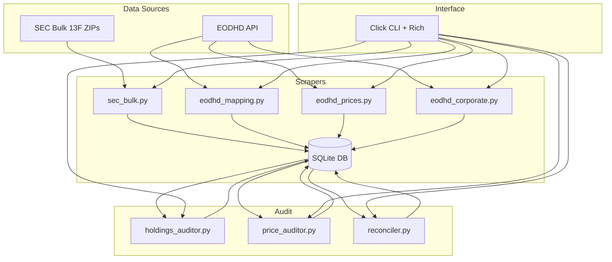

# Concepts & Architecture

## Architecture Layers

## Key Domain Entities

| Entity | Description |
|--------|-------------|
| Filer | An institutional investment manager (identified by CIK) |
| Filing | A single 13F-HR or 13F-HR/A submission for a quarter |
| Holding | One position within a filing (CUSIP + shares + value) |
| Security | A resolved CUSIP → ticker mapping |
| Corporate Action | Split, reverse split, symbol change, delisting |
| Price | Daily OHLCV + adj_close for a ticker |

## Data Flow

1. **SEC Bulk Download**: Quarterly ZIP files → parse TSV → filers, filings, holdings tables
2. **CUSIP Resolution**: Distinct CUSIPs from holdings → EODHD ID Mapping API → securities table
3. **Price Download**: Resolved tickers → EODHD EOD API → prices table
4. **Corporate Actions**: Resolved tickers → EODHD splits/dividends API → corporate_actions table
5. **Audit**: Cross-validate holdings × prices, detect anomalies → audit_results table

## Storage Schema

| Table | Purpose |
|-------|---------|
| `filers` | Manager CIK, name, address |
| `filings` | One row per 13F filing (CIK + quarter) |
| `holdings` | Individual positions within filings |
| `securities` | CUSIP → ticker mapping with confidence |
| `prices` | Daily OHLCV + adj_close per ticker |
| `benchmark_prices` | SPY/GSPC benchmark prices |
| `corporate_actions` | Splits, symbol changes, delistings |
| `scrape_jobs` | Job tracking for resumability |
| `audit_results` | Findings from audit pipeline |

## Critical Business Rules

- **Value cutover (Jan 2023)**: Pre-2023 SEC values are in thousands; post-2023 in actual dollars
- **Amendments**: RESTATEMENT replaces original holdings; NEW HOLDINGS appends
- **Options**: Tracked with `put_call` flag, excluded from return calculations
- **CUSIP formats**: SEC uses 9-digit, EODHD may expect 6-digit — try both
