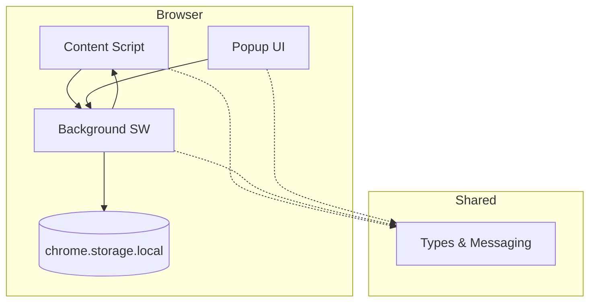

# Concepts & Architecture

## Architecture Layers

### 1. Background Service Worker (`src/background/`)
- Central coordinator for the extension
- Handles all messages from content scripts and popup
- Manages persistent state via chrome.storage.local
- No DOM access — runs in an isolated worker context
- Terminates after ~30s of inactivity

### 2. Content Script (`src/content/`)
- Injected into web pages
- Has access to the page DOM
- Communicates with background via typed messages
- Uses idempotency guard to prevent double initialization

### 3. Popup (`src/popup/`)
- React 19 SPA opened from the extension icon
- Communicates with background via typed messages
- Styled with Tailwind CSS v4

### 4. Shared (`src/shared/`)
- Type definitions (discriminated union messages)
- Messaging helper functions
- Constants and storage keys

## Data Flow & State Management

- **Source of truth**: `chrome.storage.local`
- **No global state library** — popup uses `useState` + messaging to background
- **Message protocol**: All inter-context communication uses typed messages via discriminated unions

## Key Domain Entities

| Entity | Description |
|--------|-------------|
| *Define based on extension purpose* | |

## Storage Schema

| Key | Type | Purpose |
|-----|------|---------|
| `settings` | object | Extension settings |
