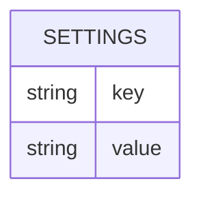

# Entity Relationship Diagram

Define entities based on the extension's purpose. Update this after the first customization session.

```mermaid
erDiagram
    SETTINGS {
        string key
        string value
    }
```
