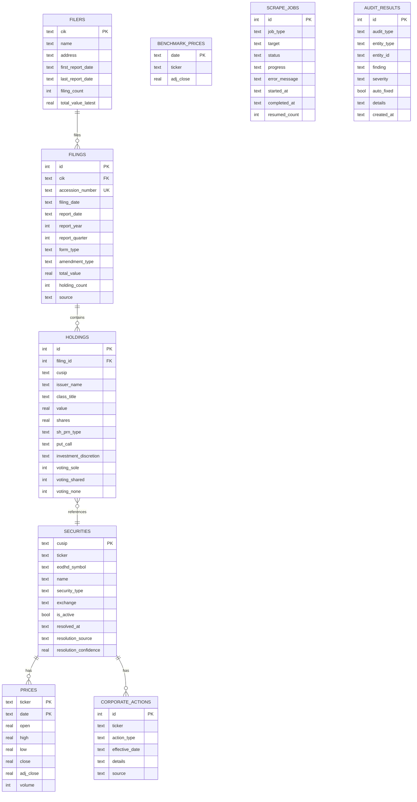

# Entity Relationship Diagram

```mermaid
erDiagram
    FILERS ||--o{ FILINGS : "files"
    FILINGS ||--o{ HOLDINGS : "contains"
    HOLDINGS }o--|| SECURITIES : "references"
    SECURITIES ||--o{ PRICES : "has"
    SECURITIES ||--o{ CORPORATE_ACTIONS : "has"

    FILERS {
        text cik PK
        text name
        text address
        text first_report_date
        text last_report_date
        int filing_count
        real total_value_latest
    }

    FILINGS {
        int id PK
        text cik FK
        text accession_number UK
        text filing_date
        text report_date
        int report_year
        int report_quarter
        text form_type
        text amendment_type
        real total_value
        int holding_count
        text source
    }

    HOLDINGS {
        int id PK
        int filing_id FK
        text cusip
        text issuer_name
        text class_title
        real value
        real shares
        text sh_prn_type
        text put_call
        text investment_discretion
        int voting_sole
        int voting_shared
        int voting_none
    }

    SECURITIES {
        text cusip PK
        text ticker
        text eodhd_symbol
        text name
        text security_type
        text exchange
        bool is_active
        text resolved_at
        text resolution_source
        real resolution_confidence
    }

    PRICES {
        text ticker PK
        text date PK
        real open
        real high
        real low
        real close
        real adj_close
        int volume
    }

    CORPORATE_ACTIONS {
        int id PK
        text ticker
        text action_type
        text effective_date
        text details
        text source
    }

    BENCHMARK_PRICES {
        text date PK
        text ticker
        real adj_close
    }

    SCRAPE_JOBS {
        int id PK
        text job_type
        text target
        text status
        text progress
        text error_message
        text started_at
        text completed_at
        int resumed_count
    }

    AUDIT_RESULTS {
        int id PK
        text audit_type
        text entity_type
        text entity_id
        text finding
        text severity
        bool auto_fixed
        text details
        text created_at
    }
```
